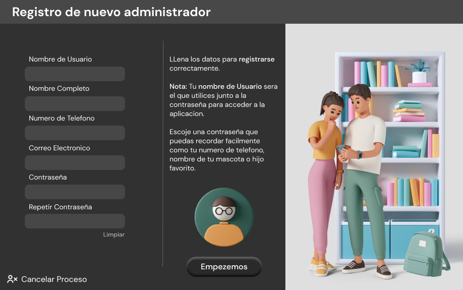
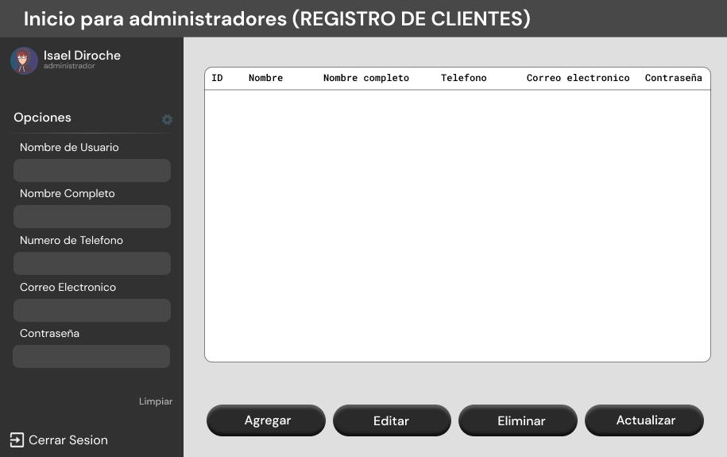

<h1>CRUD-Tarea4</h1>
<h2>Tarea numero 4 de programacion 1 con el maestro Kelyn Tejeda.</h2>

Mi nombre es Isael Diroche 2021-0318 y en el siguiente video describo lo mas brebe lo que es el programa solicitado espero y cumpla con los requisitos y sea de su agrado. Gracias!  


Primero que todo aqui le dejo el link del video en youtube por si las moscas <a href="https://youtu.be/1cw4r2YS49s">enlace del video </a> </br>

Ahora le voy a contar un poco acerca del proyecto y de sus aspectos que hacen que cumpla con los diferentes mandatos que se han propuesto en el pdf.


>BOTONES

<p>Lo primero es que el boton <b>salir</b> con una sintaxis basica que indica que el sistema deje de ejecutar saliendo del programa</p>
```java
System.exit(0);
```
</br>

<p>El boton <b>Acceder</b></p> En este Instanciamos con el metodo conexion para conectar con la base de datos posteriormente creamos variables de cadenas para almacenar los valores de los TextField (Cuadros de texto) y comparar esta informacion colocada con la que tenemos en la base de datos y si estos estan en la base de datos pues se iniciara seccion en el programa abriendo Tabla.java.</br>

Luego de esto cerramos la conexion con cn.con.close();  Sin olvidar que entramos todo dentro de un Try Catch para recojer errores y evitar que estos errores detengan nuestro programa.
```java
String Pass = new String(Password.getPassword());
        String User = Username.getText();
        
        System.out.println(Pass +"\n"+User);
        String sql = "select * from administrador where nombreUsuario = '" + User + "' and contrasena = '"+ Pass + "'";

        try {
            Connection con = cn.conexion();
            Statement st = con.createStatement();
            ResultSet rs = st.executeQuery(sql);
            if(rs.next()){
                Tabla tabla = new Tabla();
                System.out.println(rs.getString("nombrecompleto"));
                
                tabla.setVisible(true);
                String nombreCompleto = rs.getString("nombrecompleto");
                this.setVisible(false);
                JOptionPane.showMessageDialog(null, "Sesion iniciada correctamente!");
                System.out.println(rs.getInt("idAdmin")+ " " + rs.getString("nombrecompleto"));
                            
            }
            while(rs.next()){
                System.out.println(rs.getInt("idAdmin")+ " " + rs.getString("nombreUsuario"));
            }
            cn.con.close();

            } catch (Exception e) {
                JOptionPane.showMessageDialog(null, "El nombre de usuario o la contraseña es incorrecta.");
                System.out.println("Ocurrio un problema con la conexion " + e);
            }
```

El boton <b>Registrarse</b> lo unico que hace es crear el nuevo Jframe con el formulario de registro. 
```java
    signup registrarse = new signup();
    registrarse.setVisible(true);
    this.setVisible(false);
```







Tabla de botones por Frames
| Login      | SignUp          | Registro  |
| :---       | :---            | :---      |
| Acceder    | Acceder         | Salir     |
| Registrate | Cancelar proceso| Agregar   |
| Salir      | git diff        | Modificar |
| Limpiar    | Limpiar         | Eliminar  |


8/4/2021

